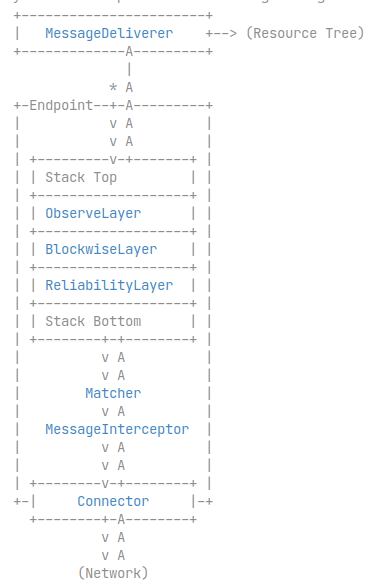

# Californium关键类
* org.eclipse.californium.core.network.stack.ReliabilityLayer

## 关键概念相应的类
* org.eclipse.californium.core.server.resources.Resource
* |-> org.eclipse.californium.core.CoapResource

## 框架相关
* org.eclipse.californium.core.network.Endpoint
* |-> org.eclipse.californium.core.network.CoapEndpoint
* org.eclipse.californium.core.server.MessageDeliverer
* org.eclipse.californium.core.network.stack.Layer
* |-> org.eclipse.californium.core.network.stack.AbstractLayer
*    |-> org.eclipse.californium.core.network.stack.ExchangeCleanupLayer
*    |-> org.eclipse.californium.core.network.stack.ObserveLayer
*    |-> org.eclipse.californium.core.network.stack.BlockwiseLayer
*    |-> org.eclipse.californium.core.network.stack.ReliabilityLayer
*        |-> org.eclipse.californium.core.network.stack.CongestionControlLayer

## 拦截切入相关类
* org.eclipse.californium.core.network.MessagePostProcessInterceptors
* org.eclipse.californium.core.network.interceptors.MessageInterceptor

# 示意图
* CoapEndpoint组成示意图 
  
* 